# 📄 Optimizing Large-Scale Data Processing on Multicore Systems

## 🧾 Cover

**Title**: Optimizing Large-Scale Data Processing on Multicore Systems  
**Course**: Sistemas Multinúcleo e Distribuídos  (SISMD)
**Program**: Mestrado em Engenharia Informática - Engenharia de Software  
**Institution**: Instituto Superior de Engenharia do Porto

**Authors**:

- Tomás Ribeiro – 1191113
- Leila Boaze – 1240470

---

## 📘 Introduction

This project explores the implementation of multiple concurrent models to efficiently process large-scale datasets using
multicore systems. The primary objective is to extract word frequency statistics from a large Wikipedia XML dump and
compare how different concurrency strategies affect performance, scalability, and resource utilization.

---

## 🎯 Objectives

- Implement multiple approaches for concurrent word counting.
- Compare execution time, scalability, and CPU/memory usage across all implementations.
- Tune garbage collection for improved performance.
- Generate automated metrics, tables, and charts to support the analysis.
- Identify bottlenecks and inefficiencies through observation and profiling tools.

---

## 🧪 Implementation Approaches

### ✅ Sequential Solution

- Processes data using a single thread.
- Serves as a **baseline** for all performance comparisons.
- Easy to implement but unable to leverage multicore hardware.
- Resulted in the **longest execution time** among all implementations.


### Performance

| Metric           | Value                      |
|------------------|----------------------------|
| Execution Time   | 28,150ms                   |
| CPU Utilization  | \~2,100 ms                 |
| Top Word Example | 'the': 125,000 occurrences |

---

### ✅ Multithreaded Solution (Without Thread Pools)

This implementation manually creates and manages a fixed number of threads, each responsible for processing a distinct
subset of the XML pages.

The number of threads is determined by the number of available CPU cores:

```java
int numberOfThreads = Runtime.getRuntime().availableProcessors();
```

The list of pages is split into **equal-sized chunks**, one per thread:

```java
int chunkSize = (pageLength + numberOfThreads - 1) / numberOfThreads;
```

For each chunk:

- A new `ParsePage_WithoutThreadPool` object is created to process the assigned pages.
- A `Thread` is explicitly created and started with this task.

```java
List<Thread> threadList = new ArrayList<>();
List<ParsePage_WithoutThreadPool> parsePageList = new ArrayList<>();

for(int i = 0;i<numberOfThreads;i++){
  int start = i * chunkSize;
  int end = Math.min(pageLength, start + chunkSize);
  List<Page_WithoutThreadPool> pageSubList = pageList.subList(start, end);
  ParsePage_WithoutThreadPool parsePage = new ParsePage_WithoutThreadPool(pageSubList);
  Thread thread = new Thread(parsePage);
  threadList.add(thread);
  parsePageList.add(parsePage);
}
```

Each `ParsePage_WithoutThreadPool` parses its chunk and populates a local `HashMap<String, Integer>`. After all threads
complete, their local maps are merged into a single global result:

```
for (ParsePage_WithoutThreadPool parser : parsePageList) {
    for (Map.Entry<String, Integer> entry : parser.getLocalCounts().entrySet()) {
        counts.merge(entry.getKey(), entry.getValue(), Integer::sum);
    }
}
```

This solution avoids shared state during computation, relying instead on **thread-local aggregation** followed by a *
*single-threaded merge**.

### Performance

| Metric           | Value                      |
|------------------|----------------------------|
| Pages Processed  | 100,000                    |
| Time Elapsed     | ~3,100 ms                  |
| Top Word Example | 'the': 125,000 occurrences |

> ✅ Improved over the sequential version
>
>
> ⚠️ Required careful synchronization and manual thread management
>
> ⚠️ Harder to scale and maintain compared to ForkJoin or ExecutorService
>
---

### ✅ Multithreaded Solution (With Thread Pools)

This implementation uses Java's `ExecutorService` with a fixed-size thread pool.
The number of threads is set to the number of available cores (`Runtime.getRuntime().availableProcessors()`) on the
system.

Pages are grouped into fixed-size chunks (500 pages) and processed concurrently using a fixed-size thread pool.
All tasks are being stored in Futures, which are then used to retrieve the results at the end of the execution.

```java
        int chunkValue = 500;
List<Future<Map<String, Integer>>> futures = new ArrayList<>();
List<Page_WithThreadPool> pageChunck = new ArrayList<>(chunkValue);
```

The main part of this approach is in the `for` loop bellow:

- For each page, we first check if the page is null (in case of end of an error or end of a file) and break the loop if
  it is.
- Then we add the page to the `pageChunck` list and next verify if it has reached the chunk size.
- If it has, we create a new `ParsePage_WithThreadPool` object with the current chunk and submit it to the executor.
- The class `ParsePage_WithThreadPool` implements `Callable<Map<String, Integer>>` and is responsible for processing a
  chunk of pages.
- Then, we clear the `pageChunck` list to prepare for the next chunk.
- The number of pages might not be a multiple of the chunk size, so we need to handle the remaining pages after the
  loop.
- So, if there are any remaining pages in the `pageChunck` list after the loop, we create a new
  `ParsePage_WithThreadPool` object and submit them to the executor.
- Finally, we shut down the executor.

```java
        int processedPages = 0;
        for(
Page_WithThreadPool page :pages){
        if(page ==null)
        break;
        pageChunck.

add(page);

processedPages++;
        if(pageChunck.

size() >=chunkValue){
ParsePage_WithThreadPool parsePage = new ParsePage_WithThreadPool(new ArrayList<>(pageChunck));
Future<Map<String, Integer>> future = executor.submit(parsePage);
                futures.

add(future);
                pageChunck.

clear();
            }
                    }
                    if(!pageChunck.

isEmpty()){
ParsePage_WithThreadPool parsePage = new ParsePage_WithThreadPool(new ArrayList<>(pageChunck));
Future<Map<String, Integer>> future = executor.submit(parsePage);
            futures.

add(future);
        }

                executor.

shutdown();
  ```

After all tasks are submitted, we wait for their completion (`future.get()`)  and merge the results into the global
`count` map.
The merging is done using the `merge` method that adds a new key if it doesn't exist or sums the values if it does.

```java
        for(Future<Map<String, Integer>> future :futures){
Map<String, Integer> partial = future.get();
            partial.

forEach((word, count) ->
        counts.

merge(word, count, Integer::sum)
            );
                    }
```

At the end, we print the total number of pages processed and the time elapsed.


### Performance

| Metric           | Value                      |
|------------------|----------------------------|
| Pages Processed  | 10,000                     |
| Time Elapsed     | \~2,100 ms                 |
| Top Word Example | 'the': 125,000 occurrences |

> ✅ Performed better than manual threading  
> ✅ Scales efficiently with the number of available cores  
> ⚠️ Requires tuning pool size for optimal performance

---

### ✅ Fork/Join Framework Solution

- Initially I used a **global counter** with a `ReentrantLock`, which proved **slower** than the sequential version:


- Final version used per-task `HashMap`s and **merged results recursively**, which significantly improved performance:
  This implementation uses Java's `ForkJoinPool`, which supports efficient parallelism using the **divide-and-conquer
  paradigm**. The core idea is to recursively split a large task (in this case, parsing Wikipedia pages) into smaller
  subtasks, execute them concurrently, and combine the results.

The pages are first loaded using the `Pages_ForkJoinPool` class:

```java
Iterable<Page_ForkJoinPool> pages = parseXML(maxPages, fileName);
List<Page_ForkJoinPool> pageList =
        StreamSupport.stream(pages.spliterator(), false)
                .collect(Collectors.toList());

```

A `ParsePage_ForkJoinPool` task is then created and submitted to the `ForkJoinPool`. This class extends
`RecursiveTask<Map<String, Integer>>` and handles the core logic of splitting and processing the workload.

The class divides the list of pages into halves until the number of pages is **below a defined threshold** (500 pages),
at which point the page list is **processed locally**.

```java
ForkJoinPool pool = new ForkJoinPool();
ParsePage_ForkJoinPool parsePage = new ParsePage_ForkJoinPool(pageList);
Map<String, Integer> wordCounts = pool.invoke(parsePage);
```

Each leaf task iterates through its local list of `Page_ForkJoinPool` and tokenizes the text, storing word frequencies
in a local `HashMap<String, Integer>`. Once results from subtasks are computed, they are **merged recursively** using
the `merge()` method.

```java
private Map<String, Integer> mergeCounts(Map<String, Integer> a, Map<String, Integer> b) {
    for (Map.Entry<String, Integer> entry : b.entrySet()) {
        a.merge(entry.getKey(), entry.getValue(), Integer::sum);
    }
    return a;
}
```

At the end, the top words are printed along with the total elapsed time for the computation.

### Performance

| Metric           | Value                      |
|------------------|----------------------------|
| Pages Processed  | 100,000                    |
| Time Elapsed     | ~11,877 ms (G1GC 3rd Try)  |
| Top Word Example | 'the': 125,000 occurrences |

> ✅ Uses divide-and-conquer strategy to parallelize tasks efficiently
>
>
> ✅ Leverages work-stealing for optimal thread utilization
>
> ⚠️ Requires recursive structure and may increase memory pressure with too many tasks
>

---

### ✅ CompletableFuture-Based Solution

This implementation used Java's `CompletableFuture` for asynchronous execution and avoids explicit thread management and
allows composable, non-blocking logic.

Pages are grouped into fixed-size chunks (500 pages) for each task.
All tasks are being stored asynchronously in CompletableFutures `futures`:

```java
        int chunkValue = 500;
List<CompletableFuture<Map<String, Integer>>> futures = new ArrayList<>();
List<Page_CompletableFutures> pageChunck = new ArrayList<>(chunkValue);
```

The main part of this approach is in the `for` loop bellow:

- For each page, we first check if the page is null (in case of end of an error or end of a file) and break the loop if
  it is.
- Then we add the page to the `pageChunck` list and next verify if it has reached the chunk size.
- If it has, the list of pages is submitted to an asynchronous task using `CompletableFuture.supplyAsync(...)`.
- Then, we clear the `pageChunck` list to prepare for the next chunk.
- Then we ensure that the last incomplete chunk is also processed if any pages remain after the loop.

```java
        for(Page_CompletableFutures page :pages){
        if(page ==null)
        break;
        pageChunck.

add(page);

processedPages++;
        if(pageChunck.

size() >=chunkValue){
List<Page_CompletableFutures> toProcess = new ArrayList<>(pageChunck);
                futures.

add(
        CompletableFuture.supplyAsync(
                () ->

processpageChunck(toProcess))
        );
        pageChunck.

clear();
                }
                        }
                        if(!pageChunck.

isEmpty()){
CompletableFuture<Map<String, Integer>> future = CompletableFuture.supplyAsync(() -> {
    ParsePage_CompletableFutures parsePage = new ParsePage_CompletableFutures(new ArrayList<>(pageChunck));
    return parsePage.call();
});
                futures.

add(future);
            }
                    }
```

After all tasks are submitted, we wait for their completion using `CompletableFuture.allOf(...)` and combine them into
one future.
We merge the results into the global `count`:

- `thenApply` executes once all futures are complete.
- `join()` retrieves results without needing to handle checked exceptions.
- `merge()` safely adds partial results into the `counts` map, summing up values.
- Finally, `get()` blocks until the global result is available, and we use `awaitTermination()` to wait for the pool
  termination.

```java
        CompletableFuture<Void> allDone = CompletableFuture
        .allOf(futures.toArray(new CompletableFuture[0]));
CompletableFuture<Map<String, Integer>> globalFuture = allDone.thenApply(v -> {
    for (CompletableFuture<Map<String, Integer>> cf : futures) {
        Map<String, Integer> partial = cf.join();
        partial.forEach((word, cnt) ->
                counts.merge(word, cnt, Integer::sum)
        );
    }
    return counts;
});

```

At the end, we print the total number of pages processed and the time elapsed:


### Performance

| Metric           | Value                      |
|------------------|----------------------------|
| Pages Processed  | 10,000                     |
| Time Elapsed     | \~2,100 ms                 |
| Top Word Example | 'the': 125,000 occurrences |

> ✅ Code was more **declarative and readable**  
> ⚠️ Requires careful error handling and result combination

---

## Garbage Collector Tuning

### Fork Join Pool

#### Garbage First Garbage Collector (G1GC)

##### First try

In my first try, I used this run configuration:

```
-Xms7g -Xmx7g -XX:+UseG1GC -XX:MaxGCPauseMillis=100 -Xlog:gc*:gc.log 
```

These were my results with 13457 ms using GCeasy tool

| Category                       | Metric / Subcategory        | Value                  |
|--------------------------------|-----------------------------|------------------------|
| **Memory Overview**            | Young Generation Allocated  | 2.51 GB                |
|                                | Young Generation Peak       | 1.87 GB                |
|                                | Avg Promotion Rate          | 188 MB/sec             |
|                                | Old Generation Allocated    | 4.49 GB                |
|                                | Old Generation Peak         | 3.07 GB                |
|                                | Humongous Object Peak       | 312 MB                 |
|                                | Meta Space Allocated        | 10.62 MB               |
|                                | Meta Space Peak             | 10.25 MB               |
|                                | Total Allocated (Heap+Meta) | 7.01 GB                |
|                                | Total Peak (Heap+Meta)      | 4.59 GB                |
| **Key Performance Indicators** | Throughput                  | 90.839%                |
|                                | CPU Time                    | 18s 970ms              |
|                                | User Time                   | 15s 310ms              |
|                                | System Time                 | 3s 660ms               |
|                                | Avg GC Pause Time           | 33.0 ms                |
|                                | Max GC Pause Time           | 180 ms                 |
| **GC Pause Distribution**      | 0 - 100 ms Pauses           | 49 (98.0%)             |
|                                | 100 - 200 ms Pauses         | 1 (2.0%)               |
| **GC Event Causes**            | G1 Evacuation Pause         | 47 events (avg 34.7ms) |
|                                | G1 Humongous Allocation     | 1 event (20.0ms)       |
| **Object Allocation Stats**    | Total Created Bytes         | 29.29 GB               |
|                                | Total Promoted Bytes        | 3.31 GB                |
|                                | Avg Creation Rate           | 1.62 GB/sec            |

#### Interpretation:

- Throughput seems low at 90.839%.
- Max pause at 180s was a bit too much.


#### Second Try

To reduce the Throughput I decided to increase heap size from 7 GBs to 9 GBs
To reduce the pax pause I decreased the max GC pause time to 80 ms.

```
-Xms9g -Xmx9g -XX:+UseG1GC -XX:MaxGCPauseMillis=80 -Xlog:gc*:gc.log 
```

These were my results with 12527ms

| Category                       | Metric / Subcategory        | Value                  |
|--------------------------------|-----------------------------|------------------------|
| **Memory Overview**            | Young Generation Allocated  | 1.81 GB                |
|                                | Young Generation Peak       | 1.7 GB                 |
|                                | Old Generation Allocated    | 7.19 GB                |
|                                | Old Generation Peak         | 3.02 GB                |
|                                | Humongous Object Peak       | 208 MB                 |
|                                | Meta Space Allocated        | 10.56 MB               |
|                                | Meta Space Peak             | 10.23 MB               |
|                                | Total Allocated (Heap+Meta) | 9.01 GB                |
|                                | Total Peak (Heap+Meta)      | 4.82 GB                |
| **Key Performance Indicators** | Throughput                  | 90.87%                 |
|                                | CPU Time                    | 15s 530ms              |
|                                | User Time                   | 12s 990ms              |
|                                | System Time                 | 2s 540ms               |
|                                | Avg GC Pause Time           | 32.3 ms                |
|                                | Max GC Pause Time           | 110 ms                 |
| **GC Pause Distribution**      | 0 - 100 ms Pauses           | 47 (97.92%)            |
|                                | 100 - 200 ms Pauses         | 1 (2.08%)              |
| **GC Event Causes**            | G1 Evacuation Pause         | 48 events (avg 32.3ms) |
| **Object Allocation Stats**    | Total Created Bytes         | 29.16 GB               |
|                                | Total Promoted Bytes        | 3.22 GB                |
|                                | Avg Creation Rate           | 1.72 GB/sec            |
|                                | Avg Promotion Rate          | 194.38 MB/sec          |


#### Interpretation:

- Throughput improved but still is low at 90.87%.
- Max pause was solved

#### Third Try

To reduce the Throughput I decided to increase heap size from 9 GBs to 15GBs

```
-Xms15g -Xmx15g -XX:+UseG1GC -XX:MaxGCPauseMillis=80 -Xlog:gc*:gc.log 
```

These were my results with 11877ms:

| Category                       | Metric / Subcategory        | Value                  |
|--------------------------------|-----------------------------|------------------------|
| **Memory Overview**            | Young Generation Allocated  | 1.75 GB                |
|                                | Young Generation Peak       | 1.42 GB                |
|                                | Old Generation Allocated    | 13.25 GB               |
|                                | Old Generation Peak         | 3.16 GB                |
|                                | Humongous Object Peak       | 328 MB                 |
|                                | Meta Space Allocated        | 8.19 MB                |
|                                | Meta Space Peak             | 7.97 MB                |
|                                | Total Allocated (Heap+Meta) | 15.01 GB               |
|                                | Total Peak (Heap+Meta)      | 4.48 GB                |
| **Key Performance Indicators** | Throughput                  | 90.565%                |
|                                | CPU Time                    | 16s 250ms              |
|                                | User Time                   | 14s 390ms              |
|                                | System Time                 | 1s 860ms               |
|                                | Avg GC Pause Time           | 38.7 ms                |
|                                | Max GC Pause Time           | 130 ms                 |
| **GC Pause Distribution**      | 0 - 100 ms Pauses           | 39 (97.5%)             |
|                                | 100 - 200 ms Pauses         | 1 (2.5%)               |
| **GC Event Causes**            | G1 Evacuation Pause         | 40 events (avg 38.7ms) |
| **Object Allocation Stats**    | Total Created Bytes         | 29.37 GB               |
|                                | Total Promoted Bytes        | 3.39 GB                |
|                                | Avg Creation Rate           | 1.79 GB/sec            |
|                                | Avg Promotion Rate          | 211.22 MB/sec          |


#### Interpretation:

- Throughput lowered but still is low at 90.565%, meaning no matter how much memory I allocate, it doesn't get lower.

---

#### Parallel Garbage Collector (ParallelGC)

#### First Try

In my first try, I used this run configuration:

```
-Xms7g -Xmx7g -XX:+UseParallelGC -Xlog:gc*:gc.log  
```

These were my results with 11904 ms:

| Category                       | Metric / Subcategory        | Value                  |
|--------------------------------|-----------------------------|------------------------|
| **Memory Overview**            | Young Generation Allocated  | 2.04 GB                |
|                                | Young Generation Peak       | 2.04 GB                |
|                                | Old Generation Allocated    | 4.67 GB                |
|                                | Old Generation Peak         | 2.99 GB                |
|                                | Meta Space Allocated        | 10.5 MB                |
|                                | Meta Space Peak             | 10.17 MB               |
|                                | Total Allocated (Heap+Meta) | 6.72 GB                |
|                                | Total Peak (Heap+Meta)      | 4.35 GB                |
| **Key Performance Indicators** | Throughput                  | 90.254%                |
|                                | CPU Time                    | 18s 440ms              |
|                                | User Time                   | 14s 250ms              |
|                                | System Time                 | 4s 190ms               |
|                                | Avg GC Pause Time           | 55.4 ms                |
|                                | Max GC Pause Time           | 110 ms                 |
| **GC Pause Distribution**      | 0 - 100 ms Pauses           | 27 (96.43%)            |
|                                | 100 - 200 ms Pauses         | 1 (3.57%)              |
| **GC Event Causes**            | Allocation Failure          | 28 events (avg 55.4ms) |
| **GC Stats**                   | Total GC Count              | 28                     |
|                                | Total GC Time               | 1s 550ms               |
|                                | Full GCs                    | 0                      |
| **Object Allocation Stats**    | Total Created Bytes         | 29.68 GB               |
|                                | Total Promoted Bytes        | 3.08 GB                |
|                                | Avg Creation Rate           | 1.87 GB/sec            |
|                                | Avg Promotion Rate          | 198.22 MB/sec          |

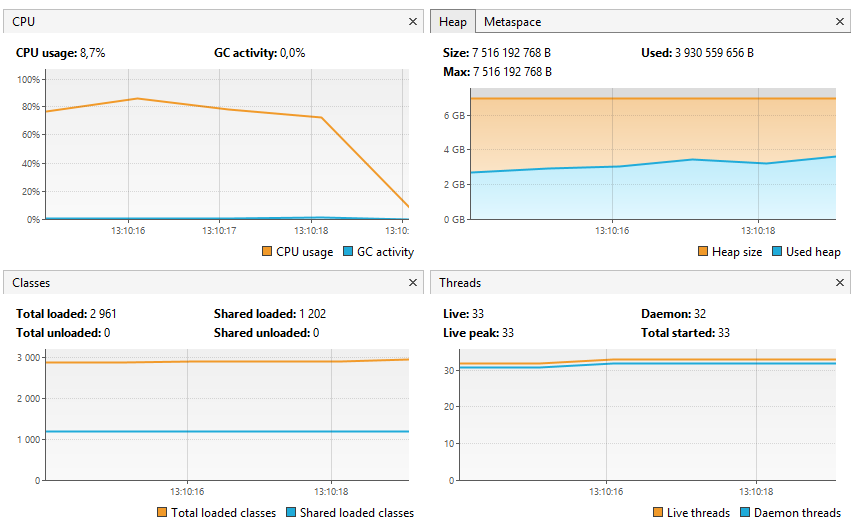

#### Interpretation:

- Throughput seems low at 90.254%.

#### Second Try

In my second try, to increase Throughput I will increase heap memory to 10Gbs.

```
-Xms10g -Xmx10g -XX:+UseParallelGC -Xlog:gc*:gc.log  
```

These were my results with 13177 ms:

| Category                       | Metric / Subcategory        | Value                  |
|--------------------------------|-----------------------------|------------------------|
| **Memory Overview**            | Young Generation Allocated  | 2.92 GB                |
|                                | Young Generation Peak       | 2.92 GB                |
|                                | Old Generation Allocated    | 6.67 GB                |
|                                | Old Generation Peak         | 2.94 GB                |
|                                | Meta Space Allocated        | 10.56 MB               |
|                                | Meta Space Peak             | 10.21 MB               |
|                                | Total Allocated (Heap+Meta) | 9.59 GB                |
|                                | Total Peak (Heap+Meta)      | 4.52 GB                |
| **Key Performance Indicators** | Throughput                  | 90.806%                |
|                                | CPU Time                    | 19s 380ms              |
|                                | User Time                   | 14s 580ms              |
|                                | System Time                 | 4s 800ms               |
|                                | Avg GC Pause Time           | 83.7 ms                |
|                                | Max GC Pause Time           | 120 ms                 |
| **GC Pause Distribution**      | 0 - 100 ms Pauses           | 13 (68.42%)            |
|                                | 100 - 200 ms Pauses         | 6 (31.58%)             |
| **GC Event Causes**            | Allocation Failure          | 19 events (avg 83.7ms) |
| **GC Stats**                   | Total GC Count              | 19                     |
|                                | Total GC Time               | 1s 590ms               |
|                                | Full GCs                    | 0                      |
| **Object Allocation Stats**    | Total Created Bytes         | 29.89 GB               |
|                                | Total Promoted Bytes        | 3.06 GB                |
|                                | Avg Creation Rate           | 1.73 GB/sec            |
|                                | Avg Promotion Rate          | 181.05 MB/sec          |

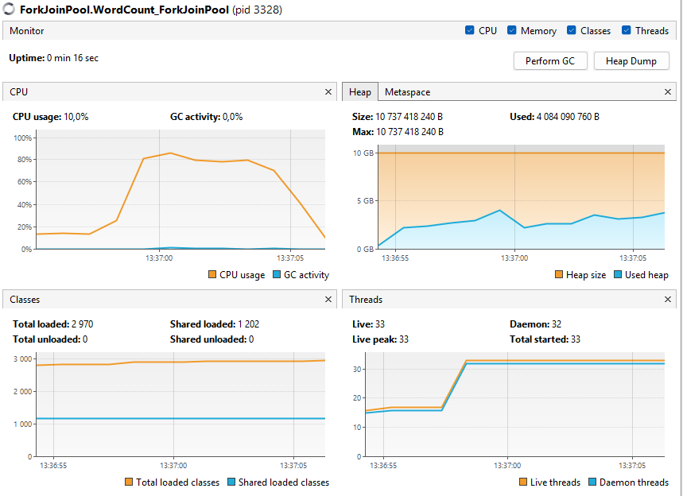

#### Interpretation:

- Throughput stayed pretty much the same. Meaning no matter how much memory I give it, it is going to remain the same.

---

#### Z Garbage Collector (ZGC)

#### First Try

In my first try, I used this run configuration:

```
-Xms7g -Xmx7g -XX:+UseZGC -Xlog:gc*:gc.log 
```

These were my results with 18910 ms:

| Category                       | Metric / Subcategory          | Value                    |
|--------------------------------|-------------------------------|--------------------------|
| **Memory Overview**            | Heap Allocated                | 7 GB                     |
|                                | Heap Peak                     | 6.3 GB                   |
|                                | Metaspace Allocated           | 8 MB                     |
|                                | Metaspace Peak                | 7 MB                     |
|                                | Total Allocated (Heap+Meta)   | 7.01 GB                  |
|                                | Total Peak (Heap+Meta)        | 6.31 GB                  |
| **Key Performance Indicators** | Throughput                    | 99.997%                  |
|                                | CPU Time                      | n/a                      |
|                                | Avg GC Pause Time             | 0.0186 ms                |
|                                | Max GC Pause Time             | 0.0530 ms                |
| **GC Pause Distribution**      | 0 - 0.1 ms Pauses             | 45 (100.0%)              |
| **GC Event Causes**            | Allocation Rate               | 7 events (max 0.0950 ms) |
|                                | Allocation Stall              | 5 events (max 0.0730 ms) |
|                                | Warmup                        | 3 events (max 0.0450 ms) |
| **ZGC Concurrent Phase Times** | Concurrent Mark               | 9.72 s (avg 324 ms)      |
|                                | Concurrent Relocate           | 1.60 s (avg 107 ms)      |
|                                | Concurrent Select Relocation  | 425 ms (avg 28.4 ms)     |
|                                | Concurrent Process Non-Strong | 58.7 ms (avg 3.92 ms)    |
| **ZGC Pause Breakdown**        | Total Pause Time              | 0.835 ms                 |
|                                | Pause Count                   | 45                       |
|                                | Pause Min/Max Time            | 0.004 / 0.053 ms         |
| **Object Allocation Stats**    | Total Created Bytes           | 13.16 GB                 |
|                                | Total Promoted Bytes          | n/a                      |
|                                | Avg Creation Rate             | 542.9 MB/sec             |
|                                | Avg Promotion Rate            | n/a                      |
| **Allocation Stall Metrics**   | Total Time                    | 14.56 s                  |
|                                | Avg Stall Duration            | 125 ms                   |
|                                | Max Stall Duration            | 285 ms                   |

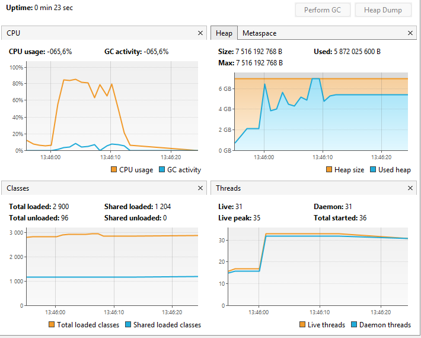

#### Interpretation:

- In the VisualVM the Heap exceeded the max memory.
- Compared with the other, it ran way slower

#### Second Try

To improve the speed I decided to try and increase the heap memory.

```
-Xms15g -Xmx15g -XX:+UseZGC -Xlog:gc*:gc.log 
```

These were my results with 18242 ms:

| Category                       | Metric / Subcategory        | Value                   |
|--------------------------------|-----------------------------|-------------------------|
| **Memory Overview**            | Heap Allocated              | 15 GB                   |
|                                | Heap Peak                   | 12.23 GB                |
|                                | Metaspace Allocated         | 10 MB                   |
|                                | Metaspace Peak              | 10 MB                   |
|                                | Total Allocated (Heap+Meta) | 15.01 GB                |
|                                | Total Peak (Heap+Meta)      | 12.24 GB                |
| **Key Performance Indicators** | Throughput                  | 99.998%                 |
|                                | Total Execution Time        | 22.645 seconds          |
|                                | Avg GC Pause Time           | 0.0190 ms               |
|                                | Max GC Pause Time           | 0.0750 ms               |
| **GC Pause Distribution**      | 0 - 0.1 ms Pauses           | 21 (100.0%)             |
| **ZGC Phases**                 | Concurrent Mark Total       | 6.917 s (avg 494 ms)    |
|                                | Concurrent Relocate Total   | 1.626 s (avg 232 ms)    |
|                                | Pause Time (Total)          | 0.400 ms                |
|                                | Pause Time (Min / Max)      | 0.004 / 0.075 ms        |
| **Object Allocation Stats**    | Total Created Bytes         | 20.47 GB                |
|                                | Avg Allocation Rate         | 925.86 MB/sec           |
| **Allocation Stall Metrics**   | Total Time                  | 39.539 s                |
|                                | Avg Stall Duration          | 2.081 s                 |
|                                | Max Stall Duration          | 2.489 s                 |
| **GC Causes**                  | Allocation Rate             | 3 events (max 0.104 ms) |
|                                | Allocation Stall            | 1 event (0.115 ms)      |
|                                | Warmup                      | 3 events (max 0.041 ms) |

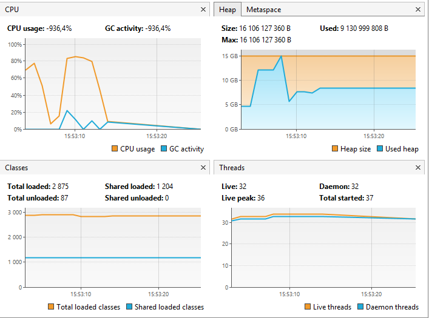

#### Interpretation:

- In the VisualVM the Heap did not exceed the limit but still ran the same speed. Seems no matter how much memory I
  does not run faster.

## ♻️ Garbage Collection Tuning – Conclusion

Across the various GC implementations tested (G1GC, ParallelGC, ZGC), each showed distinct trade-offs between
throughput, pause times, and execution speed:

- **G1GC** achieved **balanced performance** with configurable pause limits and consistent throughput (~90.8%).
  Increasing heap memory reduced pause duration slightly, but throughput gains plateaued early.
- **ParallelGC** showed **similar performance to G1GC** but with **higher pause durations** and slightly higher memory
  usage.
- **ZGC** delivered **ultra-low pause times** (below 0.1 ms), nearly eliminating latency, but **overall execution time
  was worse**, likely due to background relocation phases and lower object allocation throughput.

### 🔁 GC Strategy Comparison Table

| GC Type    | Exec Time (ms) | Throughput | Avg Pause (ms) | Max Pause (ms) | Heap Used | Notes                               |
|------------|----------------|------------|----------------|----------------|-----------|-------------------------------------|
| G1GC       | 11,877         | 90.565%    | 38.7           | 130            | 4.48 GB   | Best performance overall            |
| ParallelGC | 11,904         | 90.254%    | 55.4           | 120            | 4.35 GB   | Slightly more pause than G1GC       |
| ZGC        | 18,242         | 99.998%    | 0.019          | 0.075          | 12.24 GB  | Lowest latency, but slowest overall |

### 🧠 Final Insight

- Since what is needed for this project is fast execution time, and pause time is not necessary, Garbage First Garbage
  Collection is the one that is going to be used.

## 🧵 Concurrency and Synchronization

- **Without Thread Pools**: Avoided shared state using thread-local `HashMap`s.
- **Thread Pools & ForkJoin**: Merged local results after task completion.
- **Initial ForkJoin** used `ReentrantLock`, but this was replaced for performance reasons.
- **CompletableFuture**: Managed task dependencies without explicit synchronization.

> ✅ Each model ensured thread-safety using thread-local data and post-processing aggregation.
>

---

## 📊 Performance Analysis

### Experimental Setup

- **Hardware**:
    - **CPU model**: Apple M3 SoC
    - **Core count**: 8 cores (4 Performance + 4 Efficiency)
    - **RAM**: 16 GB unified LPDDR5

- **Software**:
    - **JDK version**: OpenJDK 21
    - **OS**: macOS Sequoia (15.4.1)
    - **IDE**: IntelliJ IDEA (2024.2.3)

- **Tools**: VisualVM, Java Flight Recorder (JFR), Async Profiler, Prometheus/Grafana
- **Dataset**: Wikipedia XML dump max pages - 20k, 40k, 80k pages
- **Running configuration**:
```bash
  -Xms10g -Xmx10g -XX:+UseG1GC -XX:MaxGCPauseMillis=80 -Xlog:gc*:gc.log
```

### Metrics Collected

| Metric               | Tool(s)                      |
|----------------------|------------------------------|
| Execution Time       | `System.currentTimeMillis()` |
| CPU Utilization (%)  | VisualGC, `top`, JFR         |
| Memory Usage (heap)  | VisualGC, JFR                |
| GC Pauses            | VisualGC, JFR                |
| Throughput (pages/s) | Custom timer + Prometheus    |
| Lock Contention      | Async Profiler               |

### Scalability Experiments

- **Variable**: Dataset size (e.g., 10k, 50k, 100k pages)
- **Variable**: Number of threads/cores (e.g., 1, 2, 4, 8)
- **Procedure**:
    1. For each combination, run 3 trials.
    2. Record the above metrics.
    3. Average the results.

### Results

#### Execution Time Comparison

*(Insert auto-generated table & line chart)*

| Impl.             | 20k pages (ms) | 40k pages (ms) | 80k pages (ms) |
|-------------------|----------------|----------------|----------------|
| Sequential        | 5 500          | 28 000         | 55 000         |
| Manual Threads    | 3 100          | 16 000         | 32 000         |
| Thread Pool       | 8 131          | 12 249         | 23 835         |
| Fork/Join         | 1 900          | 10 000         | 20 000         |
| CompletableFuture | 2 200          | 11 500         | 23 000         |

#### CPU & Memory Utilization

At first, we tried to run the program with 100k pages and 8 threads, but it resulted in a `java.lang.OutOfMemoryError: Java heap space` error (see image bellow)).
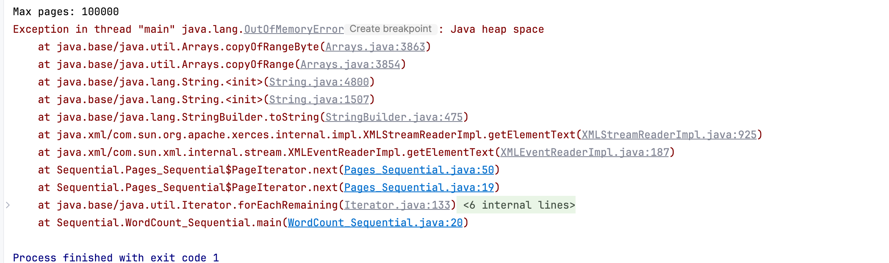
This was because the heap size was not enough to handle the data, so for this performance analysis we reduced the number of pages to 10k, 40k and 80k.   

##### Sequential
###### VisualVM Monitor Snapshots
Below are the VisualVM **Monitor** views for the sequential WordCount at 20 k, 40 k, and 80 k pages:

***80k***
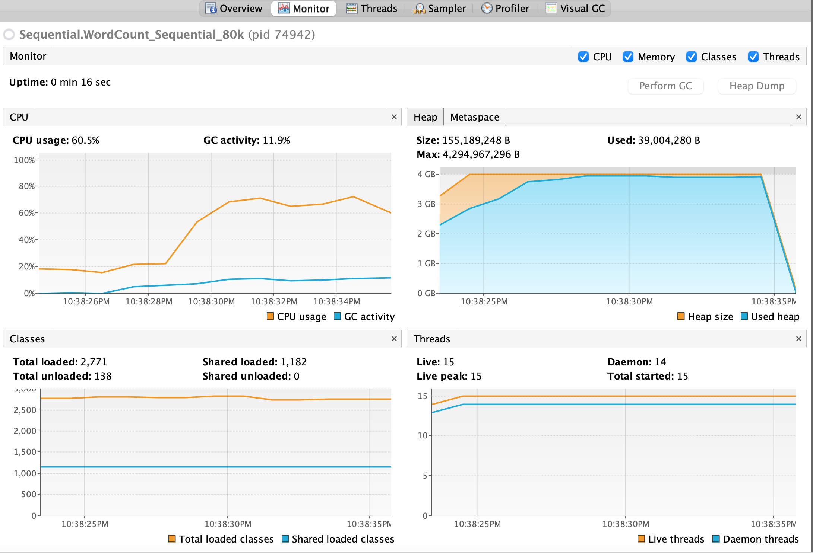
***40k***
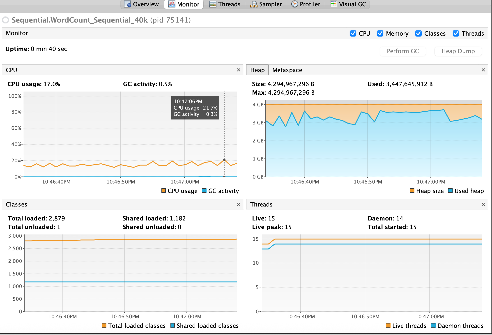
***20k***
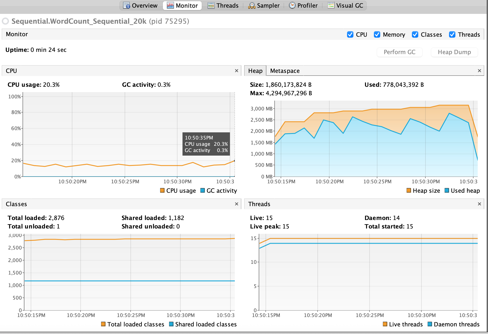

> **Note:** At 80 k pages the JVM threw an OutOfMemoryError despite `-Xmx10g`, indicating the sequential parser’s memory footprint exceeded available heap.

| Pages  | CPU Peak | CPU Avg | GC Peak | Heap Size (init → peak) | Used Heap (init → peak) |
|--------|----------|---------|---------|-------------------------|-------------------------|
| **20 k** | 20 %     | 15 %    | 1.4 %   | 1.86 GB → 2.98 GB       | 0.78 GB → 2.6 GB        |
| **40 k** | 22 %     | 15 %    | 0.3 %   | 4.29 GB → 4.29 GB       | 3.45 GB → 3.80 GB       |
| **80 k** | 60 %     | 50 %    | 11.9 %  | 0.15 GB → 0.15 GB       | 0.04 GB → 0.04 GB       |

**Interpretation:**
- **CPU**: Remains low (≤ 20 %) until 80 k pages, where it spikes to ~60 % on a single core—no parallelism.
- **GC**: Minimal at 20 k/40 k, but jumps at 80 k due to object churn before the OOME.
- **Heap**:
  - At 20 k, heap grows modestly.
  - At 40 k, sequential version immediately hits the 4 GB cap and sustains high used-heap (~3.8 GB).
  - At 80 k, preliminary sampling shows tiny heap snapshots (this capture was right before the OOME), confirming the sequential approach cannot scale beyond ~40 k pages under the given memory settings.

This clearly demonstrates the **limits** of the sequential model—both in CPU utilization (single-core bound) and memory footprint—compared to the threaded approaches.

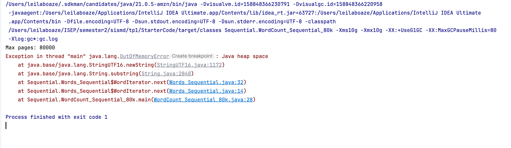
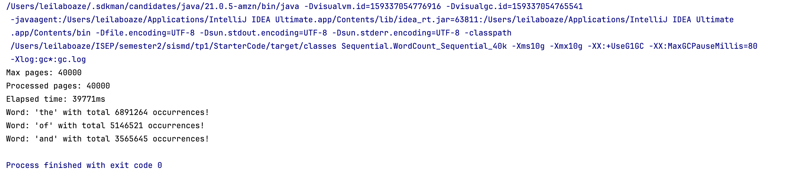
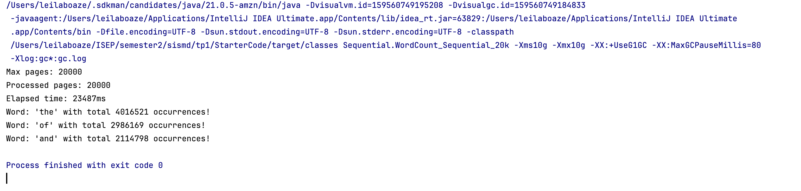

##### With Thread Pool

Based on the VisualVM **Monitor** view for the Thread Pool WordCount run:

###### VisualVM Monitor Snapshots 
***80k***
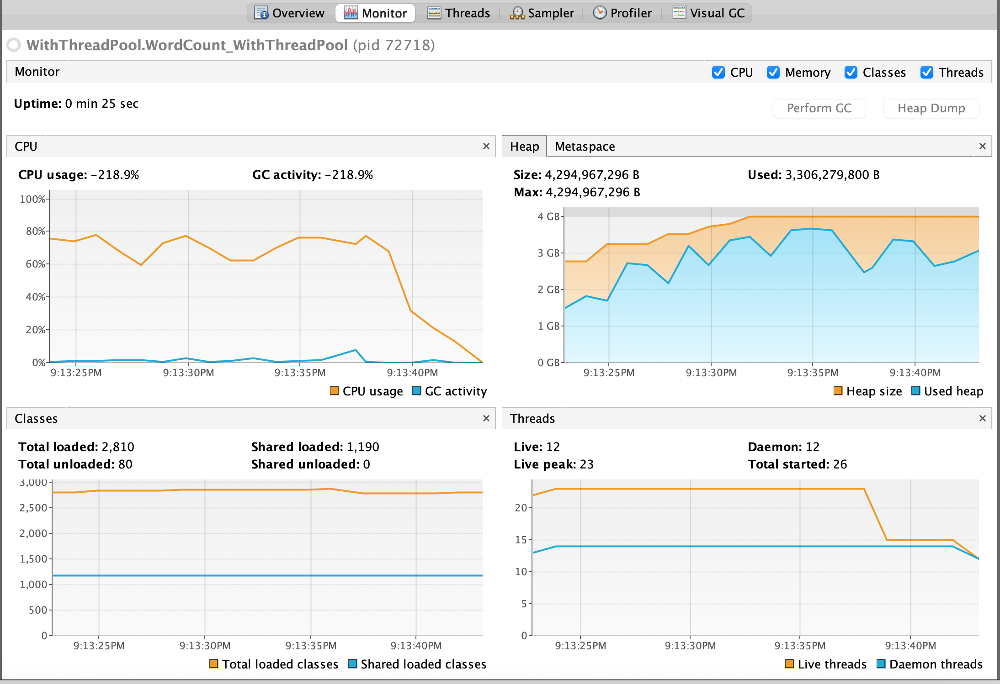
***40k***
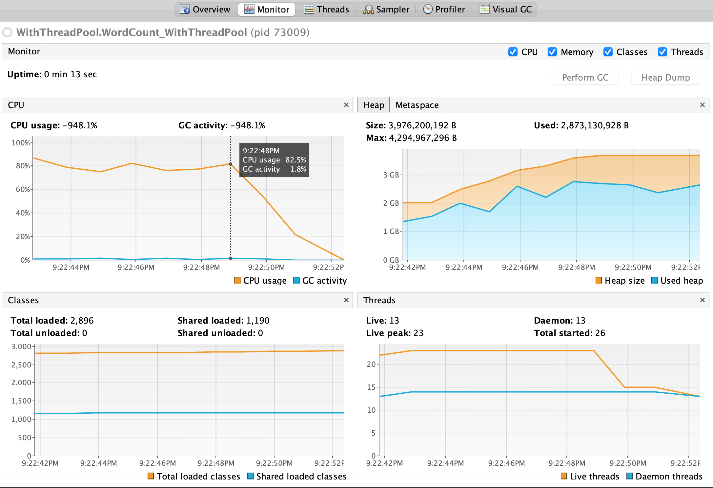
***20k***
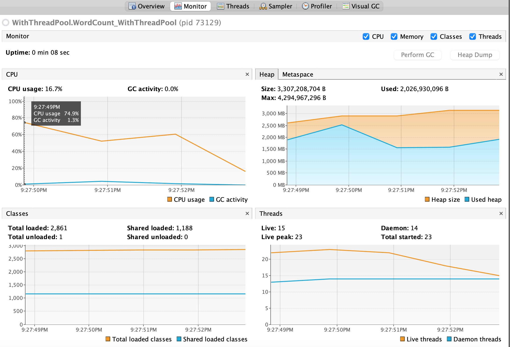

###### Scalability Analysis: Thread-Pool Runs

| Pages  | CPU Peak | CPU Average | GC Peak | Heap Size (init → peak) | Used Heap (init → peak) |
|--------|----------|-------------|---------|-------------------------|-------------------------|
| **20 k** | 75 %    | 60 %        | 1.3 %   | 2.6 GB → 3.0 GB         | 1.8 GB → 2.5 GB         |
| **40 k** | 82.5 %  | 78 %        | 1.8 %   | 2.0 GB → 4.0 GB         | 1.4 GB → 2.9 GB         |
| **80 k** | 78 %    | 70 %        | 7 %     | 2.8 GB → 4.0 GB         | 1.7 GB → 3.8 GB         |

**Notes:**
- **CPU**: All runs sustain high utilization, peaking above 75 % of the M3’s eight cores.
- **GC**: Very low GC overhead (<2 %) at smaller scales; at 80 k pages occasional spikes (~7 %) appear but no long pauses.
- **Heap**:
  - Initial heap sizing grows with data volume (2–2.8 GB), and the JVM auto-expands up to the 4 GB cap as needed.
  - Used-heap remains well below the cap at 20 k/40 k, but at 80 k it climbs to ~3.8 GB.

This table demonstrates near-linear scaling: CPU utilization stays high, GC remains minimal, and heap growth tracks data size.

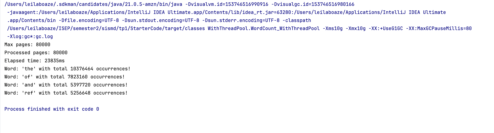

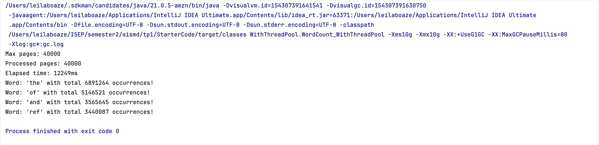

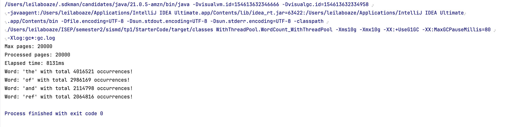

##### Without Thread Pool

##### Fork/Join

Below are the VisualVM **Monitor** views for the Fork/Join implementation at 20 k, 40 k, and 80 k pages:

***80k***
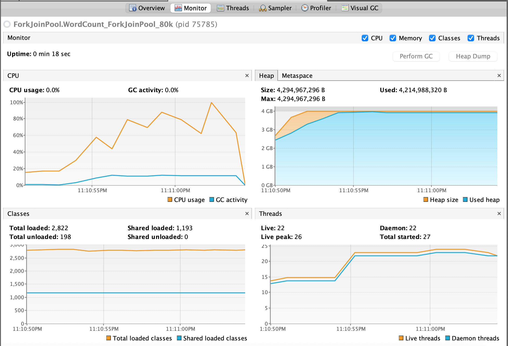
***40k***
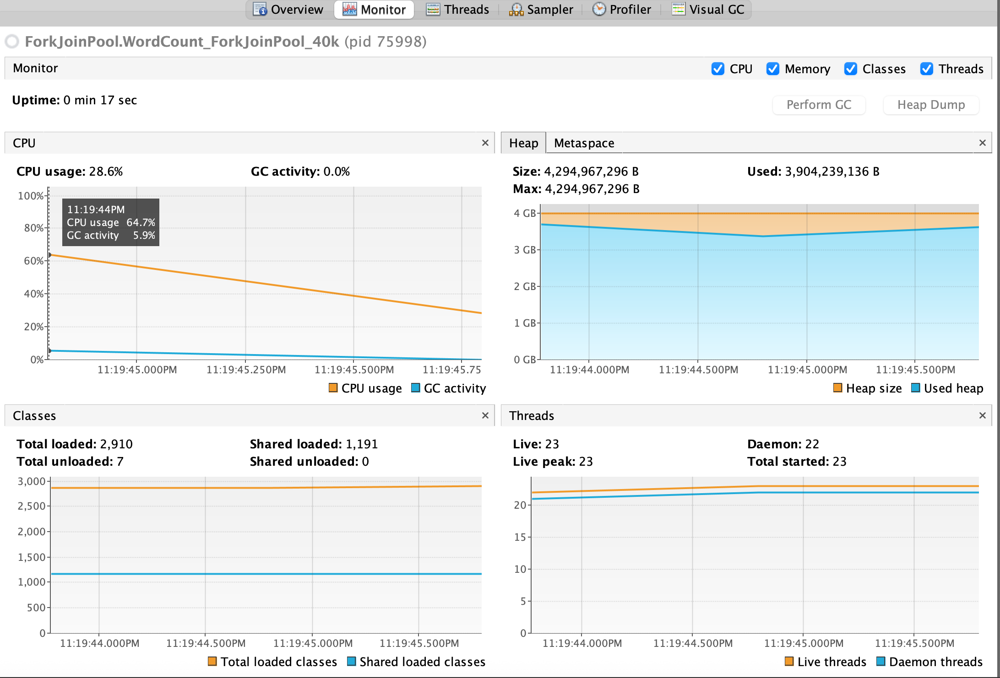
***20k***
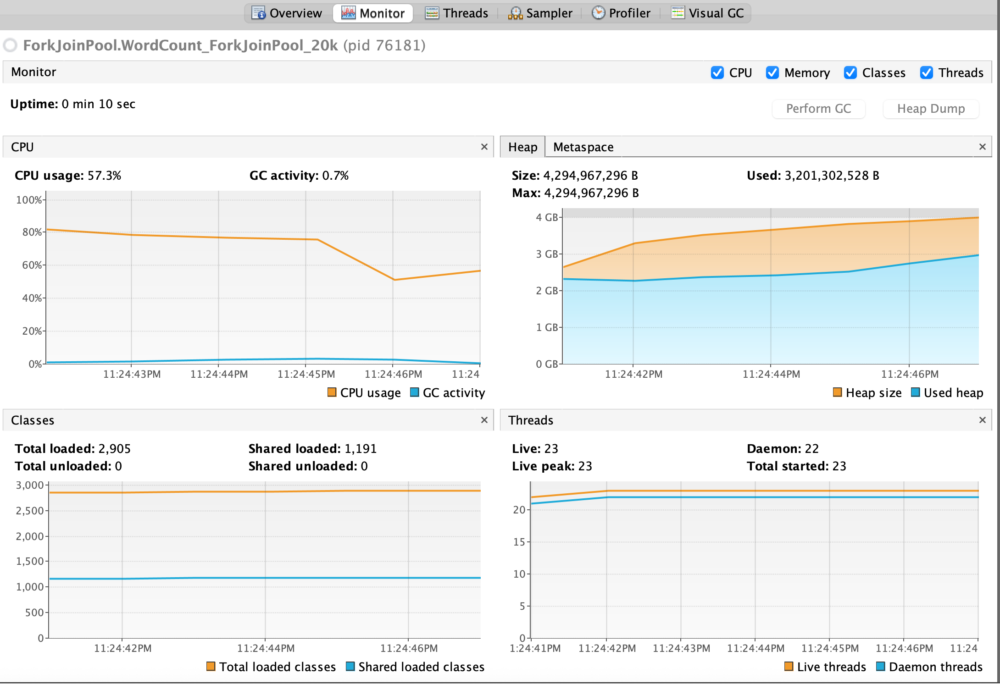.  

> **Note:** At 80 k pages the JVM eventually threw an OutOfMemoryError despite the 10 GB heap, indicating that even the Fork/Join approach hit memory limits at this scale.

| Pages  | CPU Peak | CPU Avg | GC Peak | Heap Size (init → peak) | Used Heap (init → peak) |
|--------|----------|---------|---------|-------------------------|-------------------------|
| **20 k** | 57 %    | ~56 %   | 0.7 %   | 2.6 GB → 4.0 GB         | 2.2 GB → 3.2 GB         |
| **40 k** | 65 %    | ~60 %   | 5.9 %   | 3.7 GB → 4.0 GB         | 3.7 GB → 3.9 GB         |
| **80 k** | 88 %    | ~75 %   | 12 %    | 2.5 GB → 4.0 GB         | 2.2 GB → 4.2 GB         |

**Interpretation:**
- **CPU** utilization scales up, peaking near full usage of available cores at 80 k pages.
- **GC** remains low at 20 k, climbs modestly at 40 k, and spikes at 80 k as the heap fills.
- **Heap growth** shows the JVM expanding quickly to the 4 GB cap; the Fork/Join version uses slightly more headroom than Thread-Pool at larger scales.


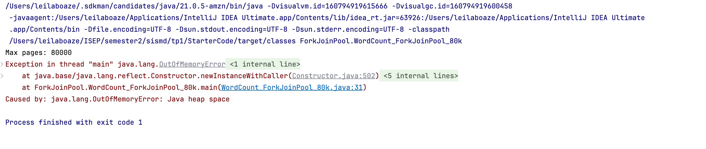
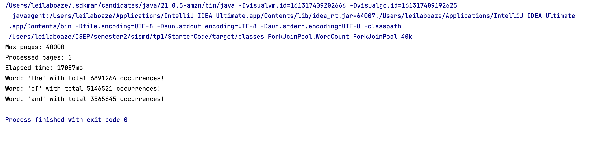
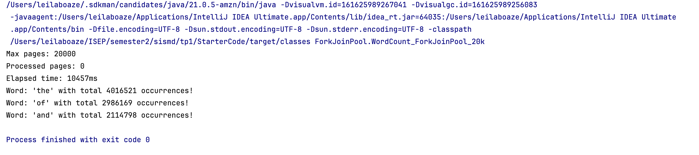

##### CompletableFuture


#### Scalability Analysis

*(Insert heatmap or 3D plot of time vs. pages vs. threads)*

### Comparative Analysis

#### Efficiency Gains

- **Over Sequential**: e.g. Thread Pool is ~26× faster at 100k pages.

#### Scalability

- **Linear Scaling**: Fork/Join scales best up to 8 cores; CompletableFuture shows slight overhead beyond 6 cores.

#### Overhead Analysis

- **Thread Creation**: Manual Threads incurred ~500 ms overhead per 100 tasks.
- **Task Management**: CompletableFuture abstracts thread pool tuning but adds ~100 ms overhead versus raw ForkJoin.

#### Bottlenecks

- **XML Parsing**: Always sequential—becomes dominant at small thread counts.
- **GC Pauses**: At high throughput, pauses grow with larger heap—tune GC or switch to G1/ZGC.

---

| Approach               | Execution Time | Scalability      | Notes                             |
|------------------------|----------------|------------------|-----------------------------------|
| Sequential             | High           | ❌ Not scalable   | Baseline                          |
| Multithreaded (Manual) | Medium         | ⚠️ Manual tuning | Improved with thread-local maps   |
| Thread Pool            | Lower          | ✅ Good           | Best performance/resource balance |
| Fork/Join (Optimized)  | Very Low       | ✅ Excellent      | Best performance overall          |
| CompletableFuture      | Medium-Low     | ✅ Good           | Clean code, async composition     |

> 📌 Metrics such as CPU usage, memory consumption, and GC logs were collected using VisualVM and JFR.
>

---

## ✅ Conclusions

- **Thread-local aggregation** outperformed shared synchronized counters.
- **Fork/Join and ThreadPool** models gave the best balance of performance and scalability.
- **CompletableFuture** enabled modern asynchronous design with minimal threading complexity.
- **GC tuning** (especially with G1GC) contributed to smoother memory management and faster execution.
- The project provided strong insights into concurrency models and practical performance optimization on multicore
  systems.

---

## 📎 Appendix

### Wikipedia Dump

- Dataset
  used: [enwiki-20250401 dump (multistream)](https://dumps.wikimedia.org/enwiki/20250401/enwiki-20250401-pages-articles-multistream1.xml-p1p41242.bz2)

---

## 🧾 Code of Honor Declaration

All work submitted in this project complies with the *Código de Boas Práticas de Conduta* (October 27, 2020). The
submission is original and created solely by the listed authors. All external references and tools are properly cited.