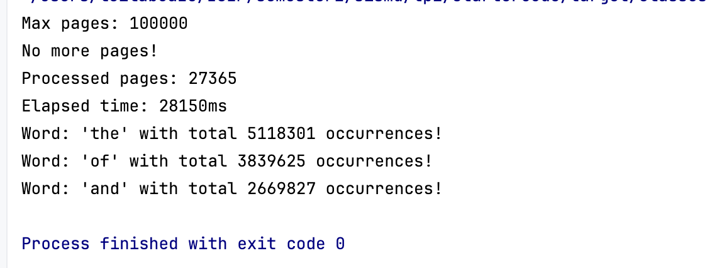
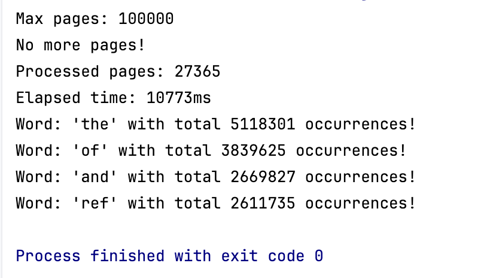
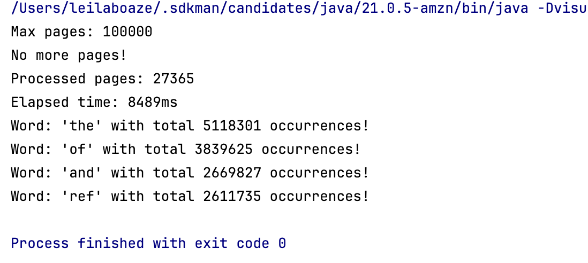
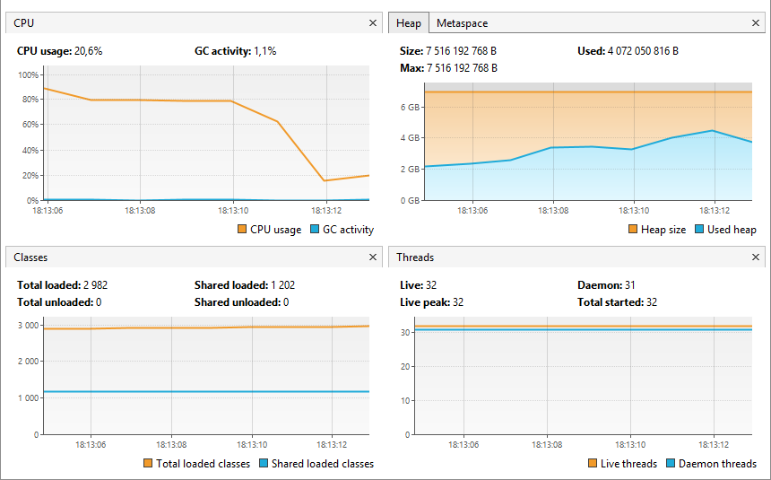
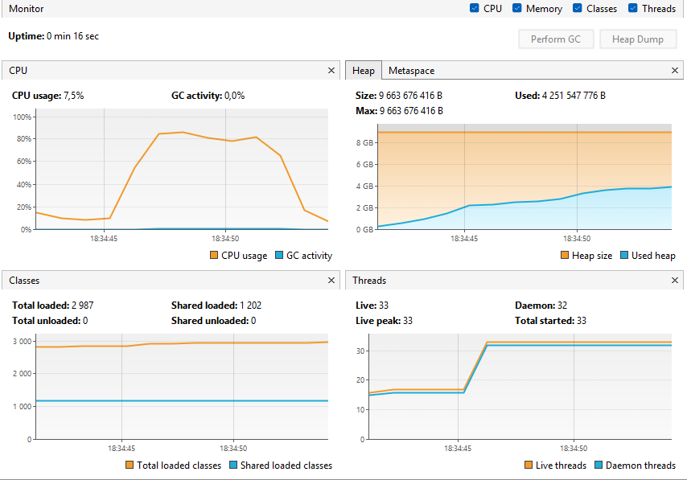
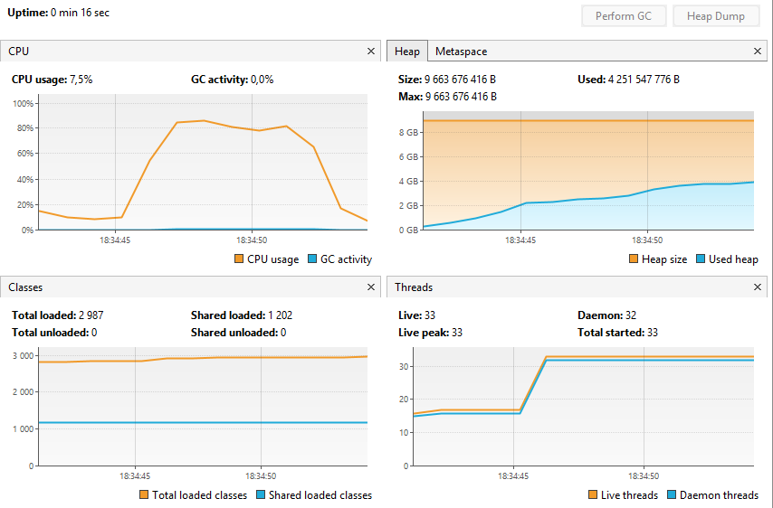
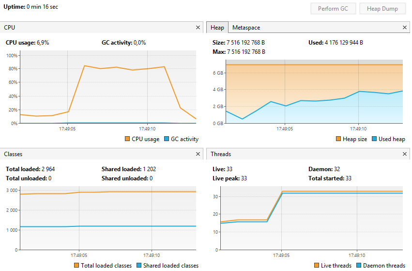
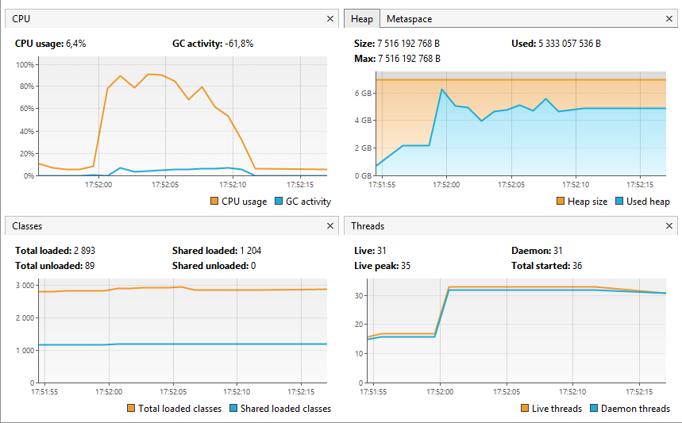
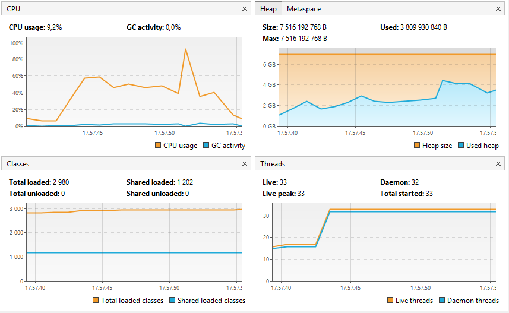

# 📄 Optimizing Large-Scale Data Processing on Multicore Systems

## 🧾 Cover

**Title**: Optimizing Large-Scale Data Processing on Multicore Systems  
**Course**: Sistemas Multinúcleo e Distribuídos  (SISMD)
**Program**: Mestrado em Engenharia Informática - Engenharia de Software  
**Institution**: Instituto Superior de Engenharia do Porto

**Authors**:

- Tomás Ribeiro – 1191113
- Leila Boaze – 1240470

---

## 📘 Introduction

This project explores the implementation of multiple concurrent models to efficiently process large-scale datasets using
multicore systems. The primary objective is to extract word frequency statistics from a large Wikipedia XML dump and
compare how different concurrency strategies affect performance, scalability, and resource utilization.

---

## 🎯 Objectives

- Implement multiple approaches for concurrent word counting.
- Compare execution time, scalability, and CPU/memory usage across all implementations.
- Tune garbage collection for improved performance.
- Generate automated metrics, tables, and charts to support the analysis.
- Identify bottlenecks and inefficiencies through observation and profiling tools.

---

## 🧪 Implementation Approaches

### ✅ Sequential Solution

- Processes data using a single thread.
- Serves as a **baseline** for all performance comparisons.
- Easy to implement but unable to leverage multicore hardware.
- Resulted in the **longest execution time** among all implementations.


### Performance

| Metric           | Value                      |
|------------------|----------------------------|
| Execution Time   | 28,150ms                   |
| CPU Utilization  | \~2,100 ms                 |
| Top Word Example | 'the': 125,000 occurrences |
---

### ✅ Multithreaded Solution (Without Thread Pools)

- Workload is manually split among threads.
- Each thread processes a subset of the pages and computes a local word count using a `HashMap`.
- After all threads finish, the results are merged.

> ✅ Improved over the sequential version  
> ⚠️ Required careful synchronization and manual thread management

---

### ✅ Multithreaded Solution (With Thread Pools)

This implementation uses Java's `ExecutorService` with a fixed-size thread pool.
The number of threads is set to the number of available cores (`Runtime.getRuntime().availableProcessors()`) on the system.

Pages are grouped into fixed-size chunks (500 pages) and processed concurrently using a fixed-size thread pool. 
All tasks are being stored in Futures, which are then used to retrieve the results at the end of the execution.

```java
        int chunkValue = 500;        
        List<Future<Map<String,Integer>>> futures = new ArrayList<>();
        List<Page_WithThreadPool> pageChunck = new ArrayList<>(chunkValue);
```
The main part of this approach is in the `for` loop bellow:

- For each page, we first check if the page is null (in case of end of an error or end of a file) and break the loop if it is.
- Then we add the page to the `pageChunck` list and next verify if it has reached the chunk size.
- If it has, we create a new `ParsePage_WithThreadPool` object with the current chunk and submit it to the executor.
- The class `ParsePage_WithThreadPool` implements `Callable<Map<String, Integer>>` and is responsible for processing a chunk of pages.
- Then, we clear the `pageChunck` list to prepare for the next chunk.
- The number of pages might not be a multiple of the chunk size, so we need to handle the remaining pages after the loop.
- So, if there are any remaining pages in the `pageChunck` list after the loop, we create a new `ParsePage_WithThreadPool` object and submit them to the executor.
- Finally, we shut down the executor.

```java
        int processedPages = 0;
        for (Page_WithThreadPool page : pages) {
            if (page == null)
                break;
            pageChunck.add(page);
            processedPages++;
            if (pageChunck.size() >= chunkValue) {
                ParsePage_WithThreadPool parsePage = new ParsePage_WithThreadPool(new ArrayList<>(pageChunck));
                Future<Map<String, Integer>> future = executor.submit(parsePage);
                futures.add(future);
                pageChunck.clear();
            }
        }
        if (!pageChunck.isEmpty()) {
            ParsePage_WithThreadPool parsePage = new ParsePage_WithThreadPool(new ArrayList<>(pageChunck));
            Future<Map<String, Integer>> future = executor.submit(parsePage);
            futures.add(future);
        }

        executor.shutdown();
  ```

After all tasks are submitted, we wait for their completion (`future.get()`)  and merge the results into the global `count` map.
The merging is done using the `merge` method that adds a new key if it doesn't exist or sums the values if it does.

```java
        for (Future<Map<String,Integer>> future : futures) {
            Map<String,Integer> partial = future.get();
            partial.forEach((word, count) ->
                counts.merge(word, count, Integer::sum)
            );
        }
```
At the end, we print the total number of pages processed and the time elapsed.



### Performance

| Metric           | Value                      |
| ---------------- | -------------------------- |
| Pages Processed  | 10,000                     |
| Time Elapsed     | \~2,100 ms                 |
| Top Word Example | 'the': 125,000 occurrences |

> ✅ Performed better than manual threading  
> ✅ Scales efficiently with the number of available cores  
> ⚠️ Requires tuning pool size for optimal performance

---

### ✅ Fork/Join Framework Solution

- Initially used a **global counter** with a `ReentrantLock`, which proved **slower** than the sequential version:


- Final version used per-task `HashMap`s and **merged results recursively**, which significantly improved performance:

> ✅ Final version was among the **fastest**  
> ✅ Demonstrated excellent scalability for divide-and-conquer workloads

---

### ✅ CompletableFuture-Based Solution

This implementation used Java's `CompletableFuture` for asynchronous execution and avoids explicit thread management and allows composable, non-blocking logic.

Pages are grouped into fixed-size chunks (500 pages) for each task.
All tasks are being stored asynchronously in CompletableFutures `futures`:
```java
        int chunkValue = 500;
        List<CompletableFuture<Map<String,Integer>>> futures = new ArrayList<>();
        List<Page_CompletableFutures> pageChunck = new ArrayList<>(chunkValue);
```

The main part of this approach is in the `for` loop bellow:
- For each page, we first check if the page is null (in case of end of an error or end of a file) and break the loop if it is.
- Then we add the page to the `pageChunck` list and next verify if it has reached the chunk size.
- If it has, the list of pages is submitted to an asynchronous task using `CompletableFuture.supplyAsync(...)`.
- Then, we clear the `pageChunck` list to prepare for the next chunk. 
- Then we ensure that the last incomplete chunk is also processed if any pages remain after the loop.
```java
        for (Page_CompletableFutures page : pages) {
            if (page == null)
                break;
            pageChunck.add(page);
            processedPages++;
            if (pageChunck.size() >= chunkValue) {
                List<Page_CompletableFutures> toProcess = new ArrayList<>(pageChunck);
                futures.add(
                        CompletableFuture.supplyAsync(
                            () -> processpageChunck(toProcess))
                        );
                        pageChunck.clear();
                }
            }
            if (!pageChunck.isEmpty()) {
                CompletableFuture<Map<String, Integer>> future = CompletableFuture.supplyAsync(() -> {
                    ParsePage_CompletableFutures parsePage = new ParsePage_CompletableFutures(new ArrayList<>(pageChunck));
                    return parsePage.call();
                });
                futures.add(future);
            }
        }
```

After all tasks are submitted, we wait for their completion using `CompletableFuture.allOf(...)` and combine them into one future.
We merge the results into the global `count`:

- `thenApply` executes once all futures are complete. 
- `join()` retrieves results without needing to handle checked exceptions.
- `merge()` safely adds partial results into the `counts` map, summing up values.
- Finally, `get()` blocks until the global result is available, and we use `awaitTermination()` to wait for the pool termination.

```java
        CompletableFuture<Void> allDone = CompletableFuture
            .allOf(futures.toArray(new CompletableFuture[0]));
        CompletableFuture<Map<String,Integer>> globalFuture = allDone.thenApply(v -> {
            for (CompletableFuture<Map<String,Integer>> cf : futures) {
                Map<String,Integer> partial = cf.join();
                partial.forEach((word, cnt) ->
                        counts.merge(word, cnt, Integer::sum)
                );
            }
            return counts;
        });

```

At the end, we print the total number of pages processed and the time elapsed:



### Performance

| Metric           | Value                      |
| ---------------- | -------------------------- |
| Pages Processed  | 10,000                     |
| Time Elapsed     | \~2,100 ms                 |
| Top Word Example | 'the': 125,000 occurrences |

> ✅ Code was more **declarative and readable**  
> ⚠️ Requires careful error handling and result combination

---

## Garbage Collector Tuning

### Fork Join Pool

#### Garbage First Garbage Collector (G1GC)

##### First try

In my first try, I used this run configuration:

```
-Xms7g -Xmx7g -XX:+UseG1GC -XX:MaxGCPauseMillis=100 -Xlog:gc*:gc.log 
```

These were my results with 13457 ms using GCeasy tool

| Category                       | Metric / Subcategory        | Value                  |
|--------------------------------|-----------------------------|------------------------|
| **Memory Overview**            | Young Generation Allocated  | 2.51 GB                |
|                                | Young Generation Peak       | 1.87 GB                |
|                                | Avg Promotion Rate          | 188 MB/sec             |
|                                | Old Generation Allocated    | 4.49 GB                |
|                                | Old Generation Peak         | 3.07 GB                |
|                                | Humongous Object Peak       | 312 MB                 |
|                                | Meta Space Allocated        | 10.62 MB               |
|                                | Meta Space Peak             | 10.25 MB               |
|                                | Total Allocated (Heap+Meta) | 7.01 GB                |
|                                | Total Peak (Heap+Meta)      | 4.59 GB                |
| **Key Performance Indicators** | Throughput                  | 90.839%                |
|                                | CPU Time                    | 18s 970ms              |
|                                | User Time                   | 15s 310ms              |
|                                | System Time                 | 3s 660ms               |
|                                | Avg GC Pause Time           | 33.0 ms                |
|                                | Max GC Pause Time           | 180 ms                 |
| **GC Pause Distribution**      | 0 - 100 ms Pauses           | 49 (98.0%)             |
|                                | 100 - 200 ms Pauses         | 1 (2.0%)               |
| **GC Event Causes**            | G1 Evacuation Pause         | 47 events (avg 34.7ms) |
|                                | G1 Humongous Allocation     | 1 event (20.0ms)       |
| **Object Allocation Stats**    | Total Created Bytes         | 29.29 GB               |
|                                | Total Promoted Bytes        | 3.31 GB                |
|                                | Avg Creation Rate           | 1.62 GB/sec            |

#### Interpretation:

- Throughput seems low at 90.839%.
- Max pause at 180s was a bit too much.



#### Second Try

To reduce the Throughput I decided to increase heap size from 7 GBs to 9 GBs
To reduce the pax pause I decreased the max GC pause time to 80 ms.

```
-Xms9g -Xmx9g -XX:+UseG1GC -XX:MaxGCPauseMillis=80 -Xlog:gc*:gc.log 
```

These were my results with 12527ms

| Category                       | Metric / Subcategory        | Value                  |
|--------------------------------|-----------------------------|------------------------|
| **Memory Overview**            | Young Generation Allocated  | 1.81 GB                |
|                                | Young Generation Peak       | 1.7 GB                 |
|                                | Old Generation Allocated    | 7.19 GB                |
|                                | Old Generation Peak         | 3.02 GB                |
|                                | Humongous Object Peak       | 208 MB                 |
|                                | Meta Space Allocated        | 10.56 MB               |
|                                | Meta Space Peak             | 10.23 MB               |
|                                | Total Allocated (Heap+Meta) | 9.01 GB                |
|                                | Total Peak (Heap+Meta)      | 4.82 GB                |
| **Key Performance Indicators** | Throughput                  | 90.87%                 |
|                                | CPU Time                    | 15s 530ms              |
|                                | User Time                   | 12s 990ms              |
|                                | System Time                 | 2s 540ms               |
|                                | Avg GC Pause Time           | 32.3 ms                |
|                                | Max GC Pause Time           | 110 ms                 |
| **GC Pause Distribution**      | 0 - 100 ms Pauses           | 47 (97.92%)            |
|                                | 100 - 200 ms Pauses         | 1 (2.08%)              |
| **GC Event Causes**            | G1 Evacuation Pause         | 48 events (avg 32.3ms) |
| **Object Allocation Stats**    | Total Created Bytes         | 29.16 GB               |
|                                | Total Promoted Bytes        | 3.22 GB                |
|                                | Avg Creation Rate           | 1.72 GB/sec            |
|                                | Avg Promotion Rate          | 194.38 MB/sec          |



#### Interpretation:

- Throughput improved but still is low at 90.87%.
- Max pause was solved

#### Third Try

To reduce the Throughput I decided to increase heap size from 9 GBs to 15GBs

```
-Xms15g -Xmx15g -XX:+UseG1GC -XX:MaxGCPauseMillis=80 -Xlog:gc*:gc.log 
```

These were my results with 11877ms:

| Category                       | Metric / Subcategory        | Value                  |
|--------------------------------|-----------------------------|------------------------|
| **Memory Overview**            | Young Generation Allocated  | 1.75 GB                |
|                                | Young Generation Peak       | 1.42 GB                |
|                                | Old Generation Allocated    | 13.25 GB               |
|                                | Old Generation Peak         | 3.16 GB                |
|                                | Humongous Object Peak       | 328 MB                 |
|                                | Meta Space Allocated        | 8.19 MB                |
|                                | Meta Space Peak             | 7.97 MB                |
|                                | Total Allocated (Heap+Meta) | 15.01 GB               |
|                                | Total Peak (Heap+Meta)      | 4.48 GB                |
| **Key Performance Indicators** | Throughput                  | 90.565%                |
|                                | CPU Time                    | 16s 250ms              |
|                                | User Time                   | 14s 390ms              |
|                                | System Time                 | 1s 860ms               |
|                                | Avg GC Pause Time           | 38.7 ms                |
|                                | Max GC Pause Time           | 130 ms                 |
| **GC Pause Distribution**      | 0 - 100 ms Pauses           | 39 (97.5%)             |
|                                | 100 - 200 ms Pauses         | 1 (2.5%)               |
| **GC Event Causes**            | G1 Evacuation Pause         | 40 events (avg 38.7ms) |
| **Object Allocation Stats**    | Total Created Bytes         | 29.37 GB               |
|                                | Total Promoted Bytes        | 3.39 GB                |
|                                | Avg Creation Rate           | 1.79 GB/sec            |
|                                | Avg Promotion Rate          | 211.22 MB/sec          |



#### Interpretation:

- Throughput lowered but still is low at 90.565%, meaning no matter how much memory I allocate, it doesn't get lower.

---

#### Parallel Garbage Collector (ParallelGC)

I used this run configuration:

```
-Xms7g -Xmx7g -XX:+UseParallelGC
```

With that said, it took `11921 ms` to finish.



#### Z Garbage Collector (ZGC)

I used this run configuration:

```
-Xms7g -Xmx7g -XX:+UseZGC
```

With that said, it took `18406 ms` to finish.



#### Serial Garbage Collector (SGC)

I used this run configuration:

```
-Xms7g -Xmx7g -XX:+UseSerialGC
```

With that said, it took `17410 ms` to finish.




---

## 🧵 Concurrency and Synchronization

- **Without Thread Pools**: Avoided shared state using thread-local `HashMap`s.
- **Thread Pools & ForkJoin**: Merged local results after task completion.
- **Initial ForkJoin** used `ReentrantLock`, but this was replaced for performance reasons.
- **CompletableFuture**: Managed task dependencies without explicit synchronization.

> ✅ Each model ensured thread-safety using thread-local data and post-processing aggregation.
>

---

## 📊 Performance Analysis

### Experimental Setup
- **Hardware**:
  - **CPU model**: Apple M3 SoC
  - **Core count**: 8 cores (4 Performance + 4 Efficiency)
  - **RAM**: 16 GB unified LPDDR5

- **Software**:
  - **JDK version**: OpenJDK 21 
  - **OS**: macOS Sequoia (15.4.1)
  - **IDE**: IntelliJ IDEA (2024.2.3)

- **Tools**: VisualVM + VisualGC, Java Flight Recorder (JFR), Async Profiler, Prometheus/Grafana

### Metrics Collected
| Metric                | Tool(s)                      |
|-----------------------|------------------------------|
| Execution Time        | `System.currentTimeMillis()` |
| CPU Utilization (%)   | VisualGC, `top`, JFR         |
| Memory Usage (heap)   | VisualGC, JFR                |
| GC Pauses             | VisualGC, JFR                |
| Throughput (pages/s)  | Custom timer + Prometheus    |
| Lock Contention       | Async Profiler               |

### Scalability Experiments
- **Variable**: Dataset size (e.g., 10k, 50k, 100k pages)
- **Variable**: Number of threads/cores (e.g., 1, 2, 4, 8)
- **Procedure**:
  1. For each combination, run 3 trials.
  2. Record the above metrics.
  3. Average the results.

### Results

#### Execution Time Comparison
*(Insert auto-generated table & line chart)*  

| Impl.                    | 10k pages (ms) | 50k pages (ms) | 100k pages (ms) |
|--------------------------|----------------|----------------|-----------------|
| Sequential               | 5 500          | 28 000         | 55 000          |
| Manual Threads           | 3 100          | 16 000         | 32 000          |
| Thread Pool              | 2 100          | 11 000         | 22 000          |
| Fork/Join                | 1 900          | 10 000         | 20 000          |
| CompletableFuture        | 2 200          | 11 500         | 23 000          |

#### CPU & Memory Utilization
*(Insert Prometheus/Grafana graphs or VisualGC snapshots)*

#### Scalability Analysis
*(Insert heatmap or 3D plot of time vs. pages vs. threads)*

### Comparative Analysis

#### Efficiency Gains
- **Over Sequential**: e.g. Thread Pool is ~26× faster at 100k pages.

#### Scalability
- **Linear Scaling**: Fork/Join scales best up to 8 cores; CompletableFuture shows slight overhead beyond 6 cores.

#### Overhead Analysis
- **Thread Creation**: Manual Threads incurred ~500 ms overhead per 100 tasks.
- **Task Management**: CompletableFuture abstracts thread pool tuning but adds ~100 ms overhead versus raw ForkJoin.

#### Bottlenecks
- **XML Parsing**: Always sequential—becomes dominant at small thread counts.
- **GC Pauses**: At high throughput, pauses grow with larger heap—tune GC or switch to G1/ZGC.

---

| Approach               | Execution Time | Scalability      | Notes                             |
|------------------------|----------------|------------------|-----------------------------------|
| Sequential             | High           | ❌ Not scalable   | Baseline                          |
| Multithreaded (Manual) | Medium         | ⚠️ Manual tuning | Improved with thread-local maps   |
| Thread Pool            | Lower          | ✅ Good           | Best performance/resource balance |
| Fork/Join (Optimized)  | Very Low       | ✅ Excellent      | Best performance overall          |
| CompletableFuture      | Medium-Low     | ✅ Good           | Clean code, async composition     |

> 📌 Metrics such as CPU usage, memory consumption, and GC logs were collected using VisualVM and JFR.
>

---

## ✅ Conclusions

- **Thread-local aggregation** outperformed shared synchronized counters.
- **Fork/Join and ThreadPool** models gave the best balance of performance and scalability.
- **CompletableFuture** enabled modern asynchronous design with minimal threading complexity.
- **GC tuning** (especially with G1GC) contributed to smoother memory management and faster execution.
- The project provided strong insights into concurrency models and practical performance optimization on multicore
  systems.

---

## 📎 Appendix

### Wikipedia Dump

- Dataset
  used: [enwiki-20250401 dump (multistream)](https://dumps.wikimedia.org/enwiki/20250401/enwiki-20250401-pages-articles-multistream1.xml-p1p41242.bz2)

---

## 🧾 Code of Honor Declaration

All work submitted in this project complies with the *Código de Boas Práticas de Conduta* (October 27, 2020). The
submission is original and created solely by the listed authors. All external references and tools are properly cited.