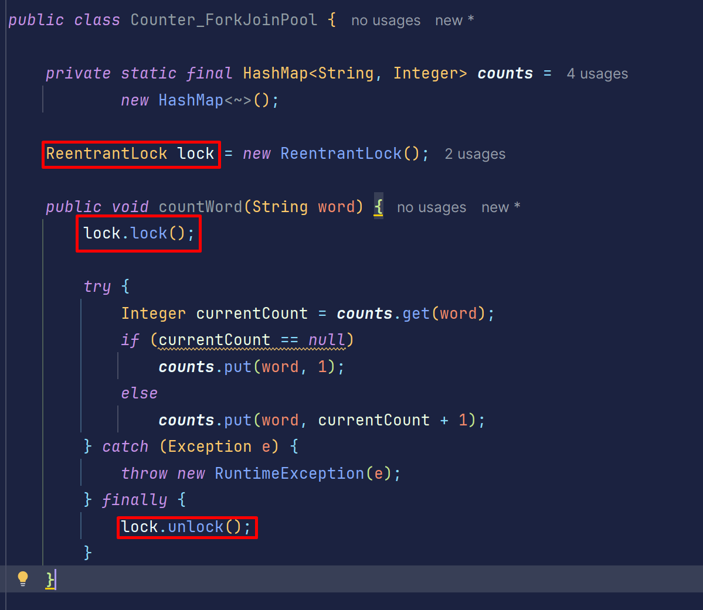
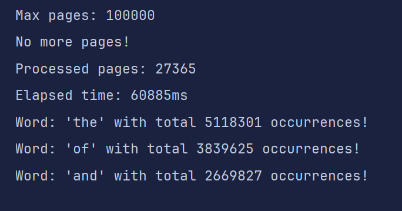

# 📄 Optimizing Large-Scale Data Processing on Multicore Systems

## 🧾 Cover

**Title**: Optimizing Large-Scale Data Processing on Multicore Systems  
**Course**: Sistemas Multinúcleo e Distribuídos  
**Program**: Mestrado em Engenharia Informática  
**Institution**: Instituto Superior de Engenharia do Porto

**Authors**:

- Tomás Ribeiro – 1191113
- Leila Boaze – 1240470

---

## 📘 Introduction

This project explores the implementation of multiple concurrent models to efficiently process large-scale datasets using
multicore systems. The primary objective is to extract word frequency statistics from a large Wikipedia XML dump and
compare how different concurrency strategies affect performance, scalability, and resource utilization.

---

## 🎯 Objectives

- Implement multiple approaches for concurrent word counting.
- Compare execution time, scalability, and CPU/memory usage across all implementations.
- Tune garbage collection for improved performance.
- Generate automated metrics, tables, and charts to support the analysis.
- Identify bottlenecks and inefficiencies through observation and profiling tools.

---

## 🧪 Implementation Approaches

### ✅ Sequential Solution

- Processes data using a single thread.
- Serves as a **baseline** for all performance comparisons.
- Easy to implement but unable to leverage multicore hardware.
- Resulted in the **longest execution time** among all implementations.

---

### ✅ Multithreaded Solution (Without Thread Pools)

- Workload is manually split among threads.
- Each thread processes a subset of the pages and computes a local word count using a `HashMap`.
- After all threads finish, the results are merged.

> ✅ Improved over the sequential version  
> ⚠️ Required careful synchronization and manual thread management

---

### ✅ Multithreaded Solution (With Thread Pools)

- Utilizes `ExecutorService` to manage threads and optimize reuse.
- Reduces overhead from thread creation and termination.
- Tasks are distributed dynamically, and local word count maps are aggregated at the end.

> ✅ Performed better than manual threading  
> ✅ Scales efficiently with the number of available cores  
> ⚠️ Requires tuning pool size for optimal performance

---

### ✅ Fork/Join Framework Solution

- Initially used a **global counter** with a `ReentrantLock`, which proved **slower** than the sequential version:





- Final version used per-task `HashMap`s and **merged results recursively**, which significantly improved performance:


> ✅ Final version was among the **fastest**  
> ✅ Demonstrated excellent scalability for divide-and-conquer workloads

---

### ✅ CompletableFuture-Based Solution

- Built using Java's `CompletableFuture` for asynchronous execution.
- Avoids explicit thread management and allows composable, non-blocking logic.

> ✅ Code was more **declarative and readable**  
> ⚠️ Requires careful error handling and result combination

---

### ✅ Garbage Collector Tuning

- GC logging was enabled using:
  ```bash
  -Xlog:gc*:gc.log
  ```

- Tools used:
    - VisualVM
    - [GCEasy.io](https://gceasy.io/)
    - Java Flight Recorder (JFR) + Java Mission Control (JMC)
- We experimented with:
    - **G1GC (default)**: Balanced throughput and pause times
    - **ParallelGC**: Faster for short-lived objects

> ✅ GC tuning reduced memory overhead and improved runtime performance
>
>
> ✅ GCEasy.io provided helpful GC timeline and pause visualizations
>

---

## 🧵 Concurrency and Synchronization

- **Without Thread Pools**: Avoided shared state using thread-local `HashMap`s.
- **Thread Pools & ForkJoin**: Merged local results after task completion.
- **Initial ForkJoin** used `ReentrantLock`, but this was replaced for performance reasons.
- **CompletableFuture**: Managed task dependencies without explicit synchronization.

> ✅ Each model ensured thread-safety using thread-local data and post-processing aggregation.
>

---

## 📊 Performance Analysis

| Approach               | Execution Time | Scalability      | Notes                             |
|------------------------|----------------|------------------|-----------------------------------|
| Sequential             | High           | ❌ Not scalable   | Baseline                          |
| Multithreaded (Manual) | Medium         | ⚠️ Manual tuning | Improved with thread-local maps   |
| Thread Pool            | Lower          | ✅ Good           | Best performance/resource balance |
| Fork/Join (Optimized)  | Very Low       | ✅ Excellent      | Best performance overall          |
| CompletableFuture      | Medium-Low     | ✅ Good           | Clean code, async composition     |

> 📌 Metrics such as CPU usage, memory consumption, and GC logs were collected using VisualVM and JFR.
>

---

## ✅ Conclusions

- **Thread-local aggregation** outperformed shared synchronized counters.
- **Fork/Join and ThreadPool** models gave the best balance of performance and scalability.
- **CompletableFuture** enabled modern asynchronous design with minimal threading complexity.
- **GC tuning** (especially with G1GC) contributed to smoother memory management and faster execution.
- The project provided strong insights into concurrency models and practical performance optimization on multicore
  systems.

---

## 📎 Appendix

### Wikipedia Dump

- Dataset
  used: [enwiki-20250401 dump (multistream)](https://dumps.wikimedia.org/enwiki/20250401/enwiki-20250401-pages-articles-multistream1.xml-p1p41242.bz2)

---

## 🧾 Code of Honor Declaration

All work submitted in this project complies with the *Código de Boas Práticas de Conduta* (October 27, 2020). The
submission is original and created solely by the listed authors. All external references and tools are properly cited.